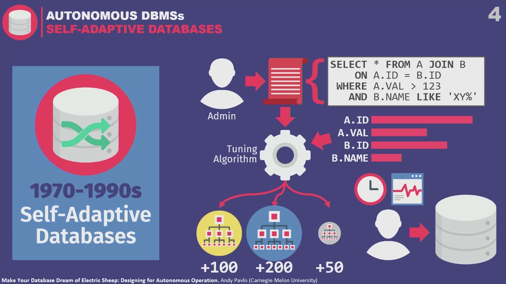
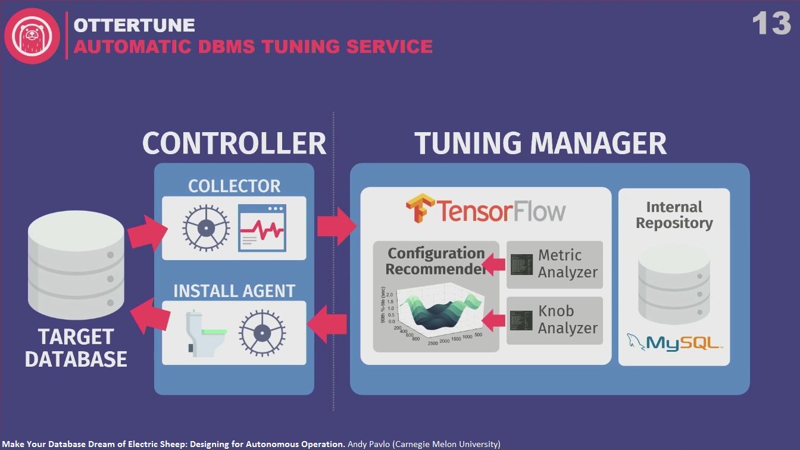
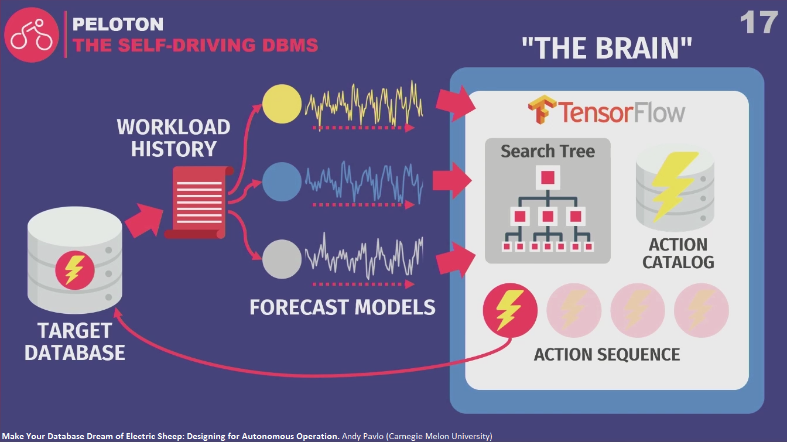

 <a href = "https://t.me/docops">docops</a>

# Make Your Database Dream of Electric Sheep: Designing for Autonomous Operation

Andy Pavlo (Carnegie Mellon University)

### History

Background – complexity of modern systems, DBAs take up 50% of cost.

1970-2000s – Self-adaptive, self-tuning databases (index selection, partitioning/sharding). Human input, workload trace analysis, human decision.

Automating knob configuration. Database knob – configuration parameter you can set to modify runtime behavior. Growing complexity for human DBAs – hundreds of knobs.

2010s – Cloud databases. Automating deployment of large number of databases in cloud environment.

### Why is this all insufficient?

* Problem 1 – Human judgements – is smth a right thing to do, observe over time if it continues to be the right thing to do, application and needs evolve. Human judgement is not scalable.
* Problem 2 – Reactionary measures – feedback on a workload trace from the past. It can’t look ahead and prepare the system to what’s coming. Humans can.
* Problem 3 – No transfer learning between database instances in all these solutions.

What’s different now? Better hardware, better machine learning tools, better appreciation for data. We seek to complete the circle in autonomous databases. Make decisions and learn from them automatically.

## 2 research projects

### OtterTune

For existing databases – black boxes – we only see what they’re exposing to us.

Database Tuning-as-a-Service

* Automatically generate DBMS knob configurations.
* Reuse data from previous tuning sessions.

Target database -> Controller (collector) -> Tuning manager (metric analyzer, knob analyzer, configuration recommender) -> Controller (install agent) -> Target database

Repeat: collect more runtime metrics, feed back into ML algorithms, see if we get better performance, make recommendation, over and over.

Objective function – latency or throughput, or whatever you want to optimize.

Another key thing that’s different about OtterTune - the only thing algorithms need to see is benign information about runtime metrics. It doesn’t need to see your data or user queries.

Live demo of OtterTune.

Comparison with DBAs. Efficiency. Scalable.

### Peloton

(in process or renaming)

What things you can do better than OtterTune if you control the entire software stack.

Self-Driving Database System

* In-memory DBMS with integrated ML framework.
* Designed for autonomous operations.

ML components can observe all aspects of database runtime behavior, and then make recommendations. Goes beyond just knob configuration like OtterTune – all other things like picking indexes, picking partition schemes, scaling up, scaling out.

Self-driving cars comparison

* Self-driving car sees what’s coming ahead in the road and makes predictions on how to get there
* Target database -> Workload history -> Forecast models (predicting how the target database’s workflow is going to look like in future – e.g. in one week from now or in one hour from now) -> Planning component “The Brain”
* Bunch of actions like “drop index”, “add index”, “scale up”, “scale out”, etc. -> sequence of actions that will get you towards maximizing your objective function -> throw out all actions except the first one, apply it and repeat the process

Being built from scratch because existing systems are too slow (e.g. adding index is slow). Apply changes and learn as quickly as possible what the right configuration is.

The first problem (predicting workload) is solved. The big problem not yet solved is action catalog. How to determine whether one action is better than another, in terms of what happens before you deploy it or after you deploy it, how you reverse things, etc. How to interact internally and with outside world. This all is ongoing research.

Story - automatic index selection tool, customer kept undoing indexes, so many times that the tool got stuck and didn’t know what to do – turned out customer didn’t like names of indexes.

### Design Considerations for Autonomous Operation

Configuration knobs

* Anything that requires a human value judgement should be marked as off-limits to autonomous components (file paths, network addresses, durability/isolation levels).
* Autonomous components need hints about how to change a knob (min/max ranges, separate knobs to enable/disable a feature, non-uniform deltas).
* Indicate which knobs are constrained by hardware resources. The problem is that sometimes it makes sense to overprovision.
* If knobs are able to tune themselves, that’s an additional externality that ML components have to model. Vendors should remove these features.

Internal metrics

* Expose DBMS’s hardware capabilities.
* Separate metrics for sub-components that are tunable (RocksDB bad example – aggregated metrics).

Action engineering

* No action should ever require the DBMS to restart in order for it to take effect.
* Provide a notification to indicate when an action starts and when it completes – need to know whether degradation is due to deployment or bad decision.
* Allow replica configurations to diverge from each other.

### Oracle rant

### Main takeaways

True autonomous DBMSs are achievable in the next decade.

For anybody who’s working on database systems – you should think about how each new feature can be controlled by a machine.
