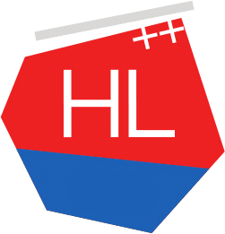

<a href = "https://www.highload.ru/spb/2019"> Saint HighLoad++</a> 
<a href = "https://knowledgeconf.ru"> KnowledgeConf</a> 
<a href = "https://t.me/docops">@docops</a>

# njs ‒ родной JavaSсript-скриптинг в nginx

(модуль для создания переменных и обработчиков стадий запроса на JavaScript)

Дмитрий Волынцев, Nginx, Inc.
<!-- START doctoc generated TOC please keep comment here to allow auto update -->
<!-- DON'T EDIT THIS SECTION, INSTEAD RE-RUN doctoc TO UPDATE -->

<!-- END doctoc generated TOC please keep comment here to allow auto update -->
