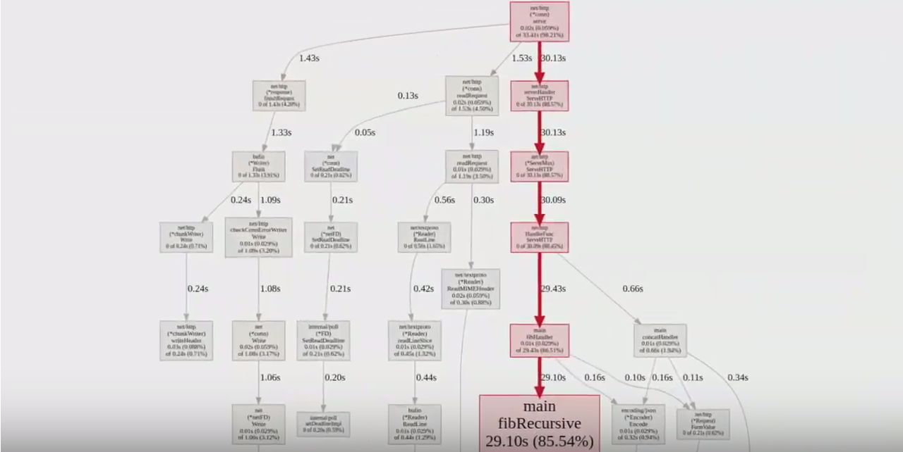
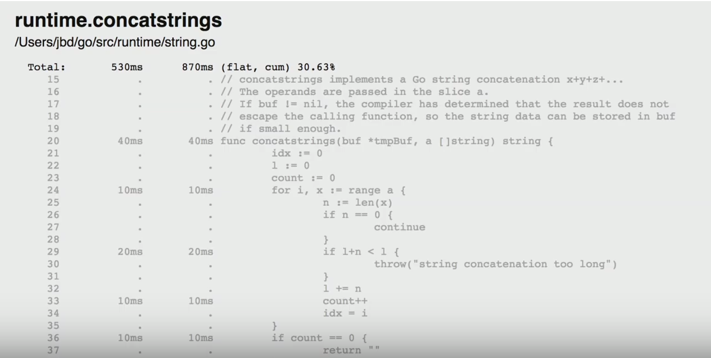

<p align="right">
<a href = "https://conf.python.ru/2019"> Moscow Python Conf++</a> 
<a href = "https://knowledgeconf.ru"> KnowledgeConf</a> 
<a href = "https://t.me/docops">@docops</a>
</p>

# Go против Python

Виталий Левченко, организатор Go-митапов в Санкт-Петербурге.

<!-- START doctoc generated TOC please keep comment here to allow auto update -->
<!-- DON'T EDIT THIS SECTION, INSTEAD RE-RUN doctoc TO UPDATE -->


- [Бенчмарки](#%D0%B1%D0%B5%D0%BD%D1%87%D0%BC%D0%B0%D1%80%D0%BA%D0%B8)
- [Аллокации в Python](#%D0%B0%D0%BB%D0%BB%D0%BE%D0%BA%D0%B0%D1%86%D0%B8%D0%B8-%D0%B2-python)
- [Асинхронность](#%D0%B0%D1%81%D0%B8%D0%BD%D1%85%D1%80%D0%BE%D0%BD%D0%BD%D0%BE%D1%81%D1%82%D1%8C)
- [Machine learning](#machine-learning)
- [Оптимизация](#%D0%BE%D0%BF%D1%82%D0%B8%D0%BC%D0%B8%D0%B7%D0%B0%D1%86%D0%B8%D1%8F)
- [Разработка](#%D1%80%D0%B0%D0%B7%D1%80%D0%B0%D0%B1%D0%BE%D1%82%D0%BA%D0%B0)
- [Обработка ошибок](#%D0%BE%D0%B1%D1%80%D0%B0%D0%B1%D0%BE%D1%82%D0%BA%D0%B0-%D0%BE%D1%88%D0%B8%D0%B1%D0%BE%D0%BA)
- [Кодировки](#%D0%BA%D0%BE%D0%B4%D0%B8%D1%80%D0%BE%D0%B2%D0%BA%D0%B8)
- [Выводы](#%D0%B2%D1%8B%D0%B2%D0%BE%D0%B4%D1%8B)

<!-- END doctoc generated TOC please keep comment here to allow auto update -->

# Бенчмарки

Как нам сравнивать языки?
Обычно начинают с бенчмарков.
Ок, давайте тоже так сделаем.

Есть бенчмарк web:

* HTTP
* Достать 16 текстов из БД
* Отсортировать и дополнить
* Отрендерить на шаблоне
* (Fortunes test)

Результаты:

| Язык   | фреймворк                   | rps    | latency, ms |
|--------|:----------------------------|-------:|------------:|
| Go     | fasthttp                    |   329k |     0.4±0.2 |
|        | native http, chi            |   128k |     2.9±1.7 |
| Python | uvicorn/starlette, gunicorn | 65-71k |     7.1±3.0 |
|        | aiohttp                     |    30k |    14.9±5.5 |
|        | django/tornado/flask        | 14-23k |     2.0±0.8 |

Источник: techempower.com/benchmarks

<!-- https://www.tablesgenerator.com/markdown_tables -->

# Аллокации в Python

* List 1M строк = 10k объектов по 100 полей.
* Размер JSON — 20Mb
* Redis отдаёт эти данные за долю миллисекунды

`json.loads()` работает 193 миллисекунды, это долго!

В Go это примерно так же долго, зато там есть кеш в памяти.
Давайте так же в Python! Что если если shared cache?

* `multiprocessing.Manager`
* Create dict: 2.2s
* Update dict: 1.7s
* И в это время приложение не может делать ничего другого с кешем.

Так, а если не shared?

* 1M объектов это примерно 100 MB памяти
* 10Gb всего
* На 28 ядер нужно 280 Gb!

Вывод: Python не подходит для обработки большого количества объектов.

# Асинхронность

Кейс — обработка очереди:

* Много запросов в БД и арифметики.
* CPU bound

На машине 14 ядер.
Вопрос: сколько воркеров надо запустить, чтобы утилизировать CPU? Оказывается, что около 100-200, зависит от базы. Если база отвечает медленнее, CPU недогружен. Если быстрее — CPU перегружается, load average 200, машинка перестаёт отвечать.

Нужны корутины.
Если корутины, то во время запроса в базу приложение обрабатывает другие потоки.
Если не корутины, то всё залочено.

В Go всё хорошо с асинхронностью:

* syscall отдает тред в scheduler;
* mutex-ы отдают управление в scheduler;
* и это всё работает из коробки, в стандартной библиотеке.

Asyncio

* Всё круто, асинхронно и без лапши
* ...пока **все** функции неблокирующие.
* А как только блокирующие, то рантайм встаёт, пока функция не разблокируется.

Поэтому приходится выбирать библиотеки, которые поддерживают asyncio.

* 11 популярных БД: aio-libs
* очень многое не production-ready
* нет важных для продакшена вещей вроде [aerospike](https://aerospike.com/)
* есть не все таймауты, приходится дорабатывать или страдать

## Коммуникация между тредами

Go: коммуникация между тредами есть из коробки.
Python: нет.

*   Уведомить корутину о graceful shutdown

    ```go
    select {
    case task := <-queue:
      // processing
    case <-closeChannel:
      waitGroup.Done()
    }
    ```
    
    В Python нужна поддержка соответствующих обработчиков и всё равно это неудобно.
    
*   Чтение разом из нескольких каналов

    ```go
    select {
    case task := <-queue1:
      // processing
    case task := <-queue2:
      // processing
    }
    ```
    
    В Python в этом случае нужно объединять потоки в единый queue c потерей типов, потом разъединить с нахождением типов...
    Всё сложно.
    
# Machine learning

Go:

*   мало production-ready библиотек
*   но можно сделать своё
*   и оно может получиться в разы быстрее

Кейс: рекомендации.
Dataset — MovieLens 1M

| Язык   | Scikit                                     |    SVD |           SVD++ |
|--------|--------------------------------------------|-------:|----------------:|
| Python | [github.com/NicolasHug/Surprise][surprise] | 2m 13s | **2h 54m 00s**  |
| Go     | [github.com/zhenghaoz/gorse][gorse]        | 1m 48s | **0h 02m 47s**  |
       
[gorse]: https://github.com/zhenghaoz/gorse
[surprise]: https://github.com/NicolasHug/Surprise

# Оптимизация

## Профилирование

В Go профилирование делается в одну строку:

* Онлайн-диагностика:
    
    ```go
    import _ "net/http/pprof"
    ```
* Ссылка работает в консоли

    ```bash
    go tool pprof -seconds 5 http://server/debug/pprof/profile
    ```
* Или сразу в браузере

## Результаты профилирования

* показывает горячие строки в либах
* list *func* даёт листинг функции
* disasm *func* даёт asm-код функции

Можно вот так посмотреть:



Есть flame-graph:


Построчный вывод:



## Наконец, оптимизация

* `gcflag -S` и `disasm` дают исполняемый asm-код
* `gcflag -m` сообщает об инлайн-функциях и аллокациях на heap'е
* Можно переписать *функцию* на C или asm
* Можно сравнить 2 профайлинга

Разработчики языка всерьёз занимаются оптимизацией и часто рассказывают о результатах.

## Online tooling

`pprof` очень хорош:

* есть профилирование CPU и памяти (heap)
* есть профилирование блокировок и их использования
* есть стектрейс для горутин
* и полный трейсинг работы приложения
* можно отслеживать создание тредов

## Moar Tooling 

Ещё фишечки:

* `go build -race`
* `go test -bench -benchmem`

# Разработка

* В Go снова всё хорошо. Апгрейды мажорных версий Go не вызывают проблем. 
* Обновление библиотек редко ломается.

    Тут важное отступление.
    Долгое время работа с зависимостями работала так: `go get` — и последняя версия
    библиотеки прилетает прямо из ветки `master` на гитхабе.
    Мейнтейнеры библиотек привыкли, что если что-то несовместимо поменять, 
    придёт много недовольных пользователей.
    
*   Python 3.6→3.7 — ломаются библиотеки.
*   Обновление мажорных версий библиотек часто ломает совместимость.

## Зависимости в Go

*   Зависимости от внешних библиотек бывают редко. 
    Если что-то нужно, то это берут и пишут в этой библиотеке.
*   В 1.12 появился go mod: 1 файл, заполняется автоматически, везде semver
*   Все зависимости лежат в общем месте с версионностью, без vendor / virtualenv.
    Нет папочки вроде `venv` или `node_modules`, в которой лежит половина интернетов.
*   Библиотеки версионируются, подписываются ключиками и проверяются по контрольным суммам.
*   Библиотеки не переделывают рантайм, не вмешиваются в работу GC, не патчат системные функции.
    Импорт библиотеки не влечёт сторонних эффектов.
    
## Своя библиотека в Go

*   Берём библиотеку с go mod
*   Анонс = git push
*   Документация сразу будет на godoc.org
*   PR приняли — можно пользоваться.
    А если (пока) не приняли, то забираем из своего форка.

В Go высокодоступная документация.
`godoc http` — и документация доступна на локальной машине, даже если вы в самолёте.
Есть один способ собирать документацию — godoc.

# Обработка ошибок

Говорят, в Go нет исключений.
Неправда, они есть, просто называются паниками.

Задачка: в скольки местах это может сломаться с исключением?

```python
def fetch_user(id: int) -> 'User':
    response = requests.get('/api/users/{0}'.format(id))
    response.raise_for_status()
    return response.json()
```

Тут могут быть разные исключения, хорошо бы их все обработать.
Go позволяет нам это сделать и даже заставляет.

```go 
func fetchUser(id string)
  (*User, error) {
  resp, err := http.Get(`/api/users/`+id)
  if err != nil {
    return nil, errors.Wrap(err, `get user by id`)
    }

  // теперь обработаем код ответа
  if resp.StatusCode != http.StatusOK {
    return nil, errors.Wrap(errors.New("API got status " + resp.Status), `get user by id`
  }
  user := &User{}

  // теперь декодируем
  if err = json.NewDecoder(resp.Body).Decode(user); err != nil {
    return nil, errors.Wrap("Incorrect user profile", err)
  }
  return user, nil
}
```

# Кодировки

* Go — сразу UTF-8
* Python — вообще UTF-8, но в легаси встречается ASCII

# Выводы

Опытному бэкендеру на самом деле не важно, на чём писать.

## Зарплаты

| Язык   |     МойКруг, РФ  |                  | GetIT, Москва, senior | StackOverflow, (медиана) |
|--------|-----------------:|-----------------:|----------------------:|-------------------------:|
|        | 75% (процентиль) | 90% (процентиль) |                       |                          |
| Python |         150 000₽ |        185 000 ₽ |         175-200 000 ₽ |            $98 000 в год |
| Go     |         178 000₽ |        225 000 ₽ |         201-250 000 ₽ |           $110 000 в год |

Вывод: писать на Go выгоднее на 20%!

## Когда Python лучше

* Когда важна скорость бутстрапинга приложения
* Задачи data science
* Нравится async/await

## Когда Go лучше

* CPU/memory/io-bound app
* Важна простота эксплуатации приложения (operations)
* Хочется интересных задач
* Хочется больше денег
